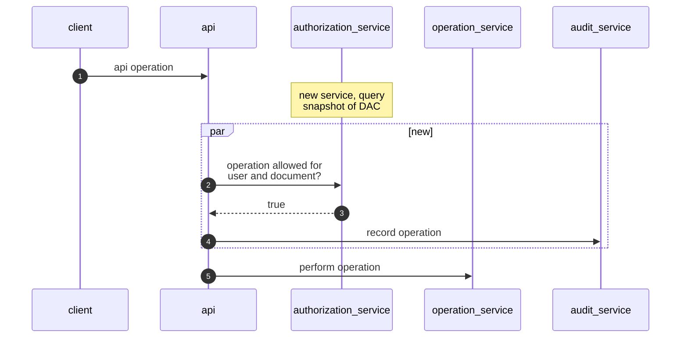
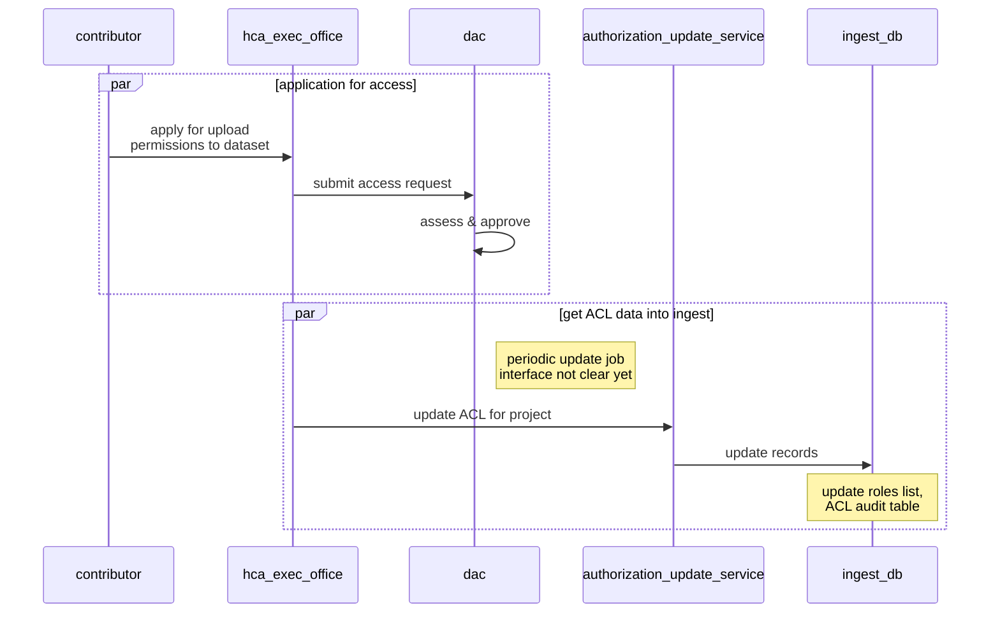
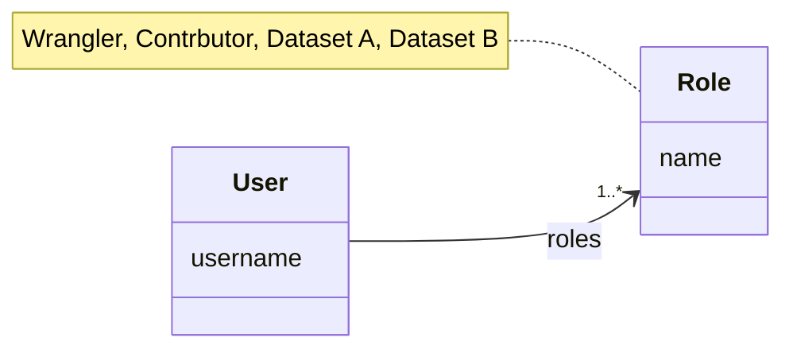
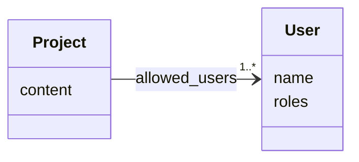

# Managed Access

## Links
- [ticket 967](https://app.zenhub.com/workspaces/dcp-ingest-product-development-5f71ca62a3cb47326bdc1b5c/issues/gh/ebi-ait/dcp-ingest-central/967)

## Terms

* ACL - Access Control List
* DAC - Data Access Committee

## ACL update

## Representing ACLs in ingest

There are 2 options to consider. We will proceed with option 1.

1. Store a list of allowed datasets for each user, in addition to the
   wrangler or contributor roles

2. Store a list of allowed users for each dataset.

