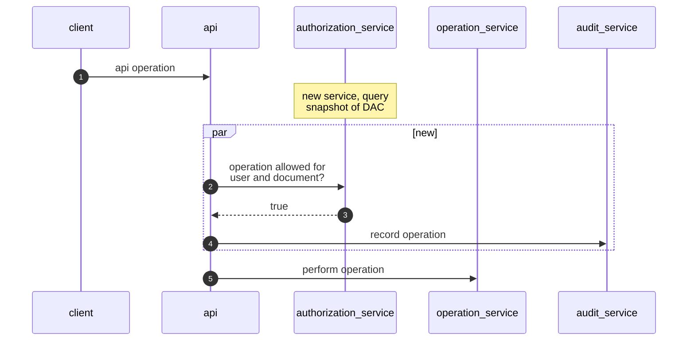
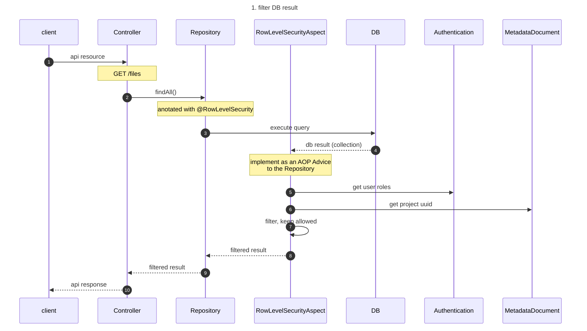
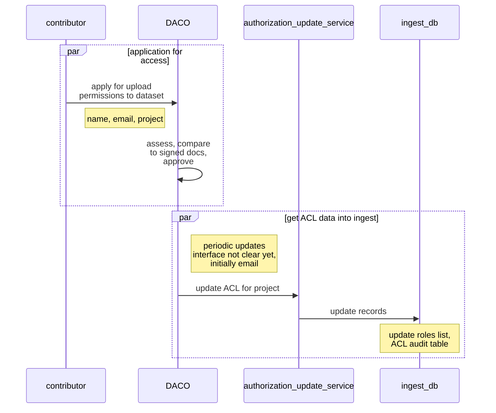
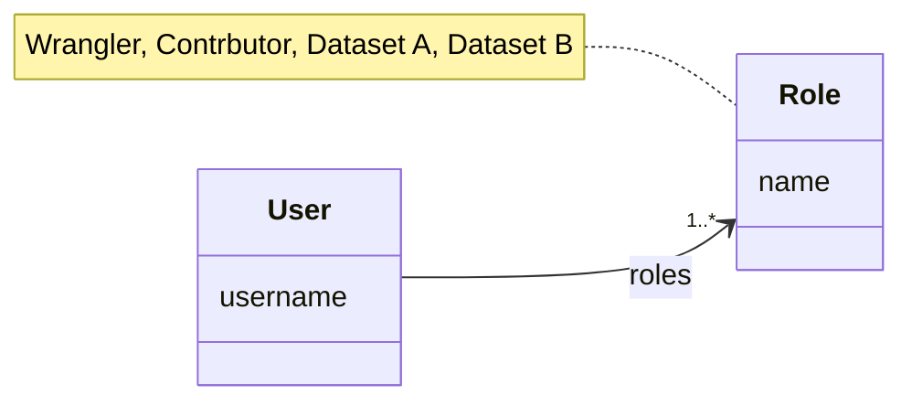
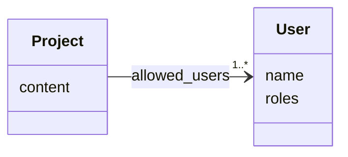
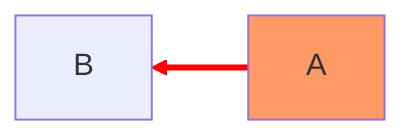

# Managed Access

## Links
- [ticket 967](https://app.zenhub.com/workspaces/dcp-ingest-product-development-5f71ca62a3cb47326bdc1b5c/issues/gh/ebi-ait/dcp-ingest-central/967)

## Terms

* ACL - Access Control List
* DAC - Data Access Committee

## API Access Control Flow

## API Access Control - Details
There are 2 options here:
1. return all records from DB & filter the output to keep the allowed records
2. instrument the query and add a criteria to return only allowed records

For 1st iteration, we'll go with option 1, which is easier to implement, but might 
perform worse for large collections.

## ACL Update Flow

## Representing ACLs in ingest

There are 2 options to consider. We will proceed with option 1.

1. Store a list of allowed datasets for each user, in addition to the
   wrangler or contributor roles

2. Store a list of allowed users for each dataset.

